# 📊 Diagramas de Arquitectura - Sistema ERP JLC

## 🏗️ Diagrama de Arquitectura General

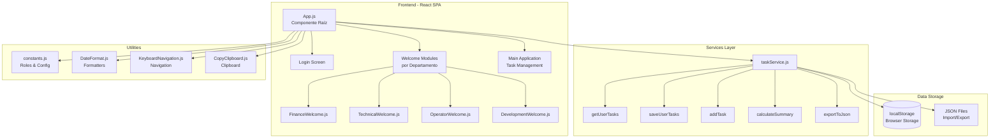

## 👥 Diagrama de Roles y Flujo de Usuario

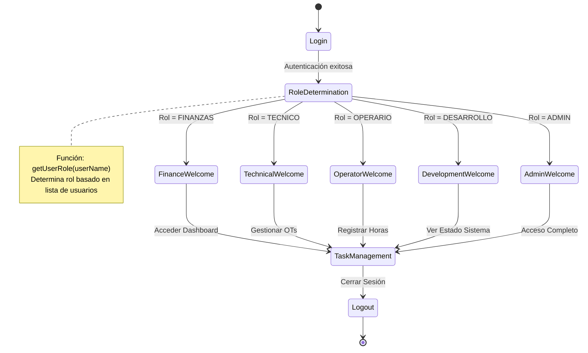

## 🔄 Diagrama de Flujo de Datos

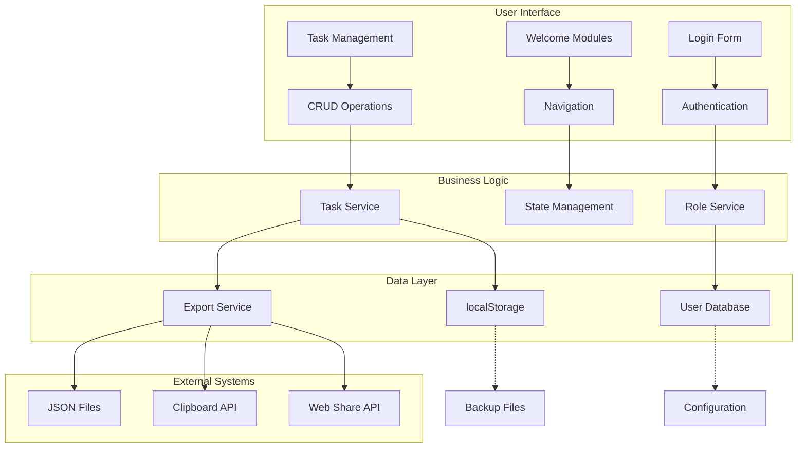

## 🧩 Diagrama de Componentes y Dependencias

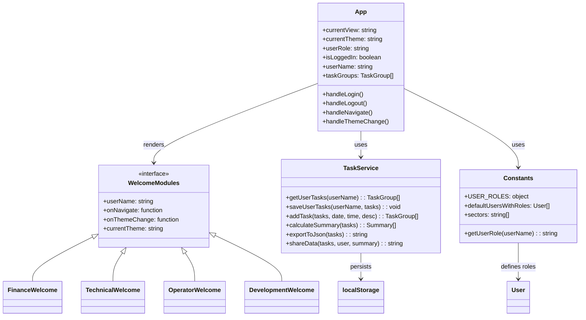

## 🔐 Diagrama de Seguridad y Roles

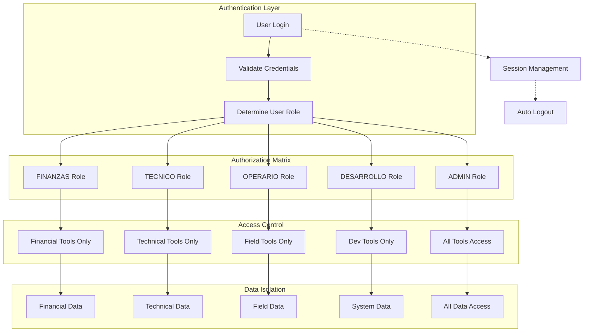

## 📱 Diagrama de Navegación y Estados

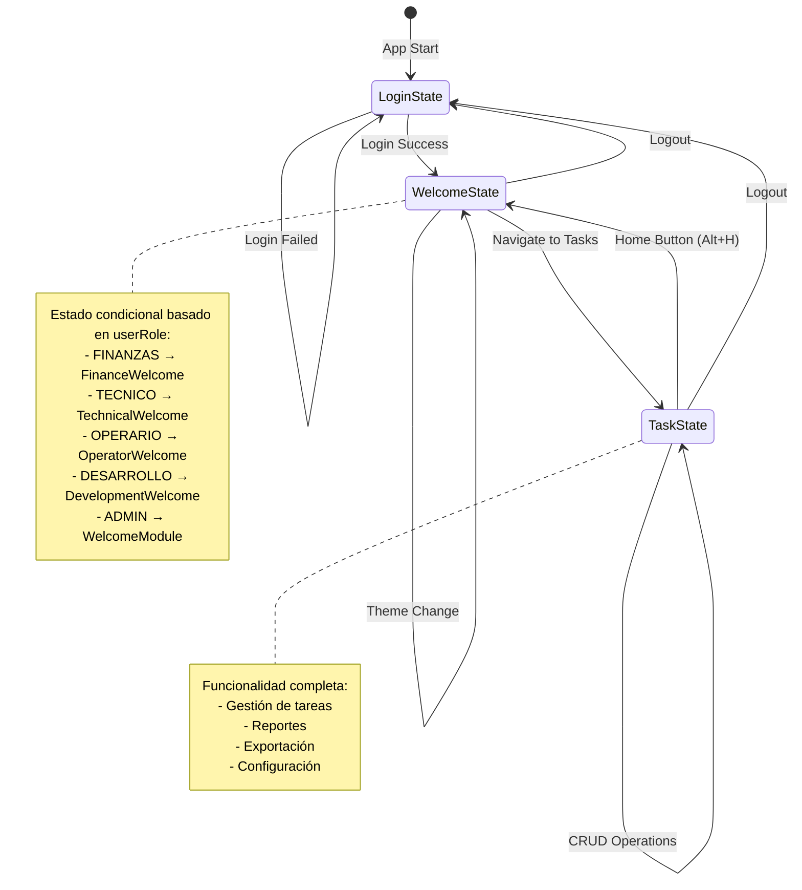

## 🔧 Diagrama de Servicios y Utilidades

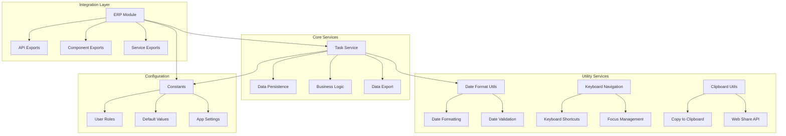

## 📊 Diagrama de Flujo de Trabajo Departamental

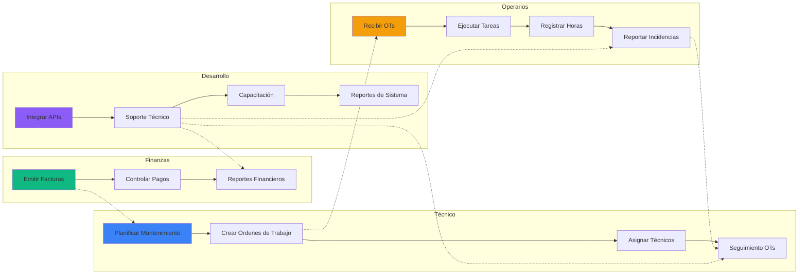

## 🗂️ Diagrama de Estructura de Archivos

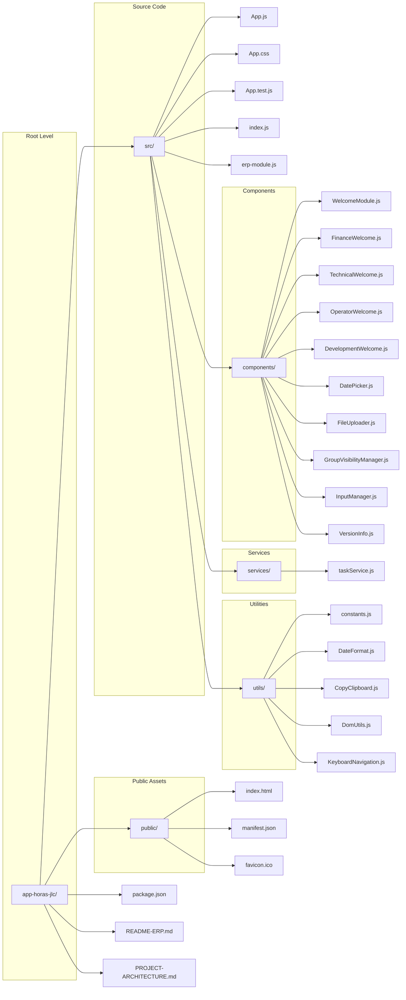

## 🔄 Diagrama de Ciclo de Vida de Componentes

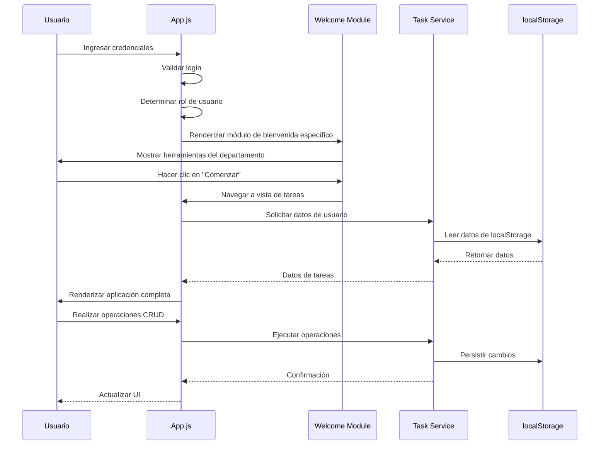

## 🎨 Diagrama de Sistema de Estilos

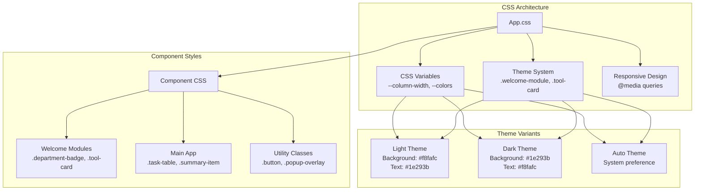

## 📈 Diagrama de Escalabilidad

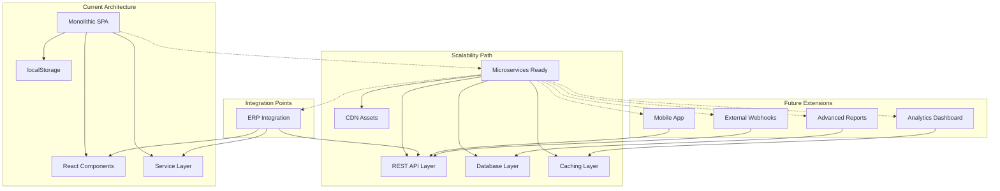

---

## 📋 Leyenda de Diagramas

### Formas y Colores
- 🔵 **Azul**: Componentes principales, navegación
- 🟢 **Verde**: Servicios y lógica de negocio
- 🟡 **Amarillo**: Utilidades y helpers
- 🟠 **Naranja**: Datos y persistencia
- 🔴 **Rojo**: Seguridad y autenticación
- 🟣 **Morado**: Integración y APIs

### Tipos de Conexión
- **→**: Flujo de datos directo
- **-->**: Respuesta/return
- **-.->**: Conexión opcional/futura
- **==>**: Transformación de datos

### Estados
- **[*]**: Estado inicial/final
- **Estado**: Estados normales del sistema
- **note**: Notas explicativas

---

**Herramientas utilizadas para diagramas**: Mermaid.js
**Formato**: Markdown con sintaxis Mermaid
**Actualización**: Septiembre 2024