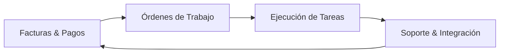

# 🏗️ Sistema ERP JLC Montajes Industriales

> **Aplicación de Gestión de Tareas transformada en ERP Departamental**

[](https://github.com/Rodolfox22/App-horas-React)
[](https://reactjs.org/)
[](LICENSE)

## 📋 Índice de Documentación

### 📚 Documentos Principales
- **[📋 PROJECT-SUMMARY.md](PROJECT-SUMMARY.md)** - Resumen ejecutivo del proyecto
- **[🏗️ PROJECT-ARCHITECTURE.md](PROJECT-ARCHITECTURE.md)** - Arquitectura completa del sistema
- **[📊 ARCHITECTURE-DIAGRAMS.md](ARCHITECTURE-DIAGRAMS.md)** - Diagramas visuales de arquitectura
- **[🔌 README-ERP.md](README-ERP.md)** - Guía de integración ERP

### 🚀 Inicio Rápido

#### Instalación
```bash
git clone https://github.com/Rodolfox22/App-horas-React.git
cd app-horas-jlc
npm install
```

#### Desarrollo
```bash
npm start          # Inicia servidor de desarrollo
npm run build      # Build de producción
npm run test       # Ejecutar tests
npm run deploy     # Desplegar a GitHub Pages
```

#### Usuarios de Prueba
| Usuario | Rol | Departamento |
|---------|-----|--------------|
| `Admin` | Admin | Acceso Completo |
| `Finanzas` | Finanzas | Control Financiero |
| `Tecnico` | Técnico | Gestión de Mantenimiento |
| `Operario` | Operario | Equipo de Campo |
| `Desarrollo` | Desarrollo | Sistemas y TI |

## 🎯 Visión del Sistema

Sistema ERP departamental especializado que transforma la gestión de tareas en una solución integral para JLC Montajes Industriales, con módulos específicos para cada área de negocio.

### ✨ Características Principales

- 👥 **Roles Especializados**: 5 roles con interfaces personalizadas
- 🏢 **Departamentos Dedicados**: Finanzas, Técnico, Operarios, Desarrollo
- 🔄 **Flujo de Trabajo Integrado**: Coordinación entre departamentos
- 📱 **App Móvil Lista**: Optimizada para equipos de campo
- 🔌 **Integración ERP**: API preparada para sistemas externos
- 🎨 **UI/UX Profesional**: Diseño moderno y responsive

## 🏛️ Arquitectura del Sistema

### Patrón de Diseño
```
Role-Based SPA → Service Layer → Data Persistence
```

### Tecnologías
- **Frontend**: React 18.3.1 + JavaScript ES6+
- **Styling**: CSS3 con variables y temas
- **Icons**: Lucide React
- **Build**: Create React App + Webpack
- **Testing**: Jest + React Testing Library
- **Deployment**: GitHub Pages

### Estructura de Archivos
```
src/
├── components/          # 9 componentes UI
│   ├── *-Welcome.js     # 4 módulos departamentales
│   ├── DatePicker.js    # Formulario inteligente
│   └── ...
├── services/           # Servicios de negocio
│   └── taskService.js  # 15+ funciones CRUD
├── utils/             # Utilidades especializadas
│   ├── constants.js    # Roles y configuración
│   └── ...
└── erp-module.js      # Integración ERP
```

## 👨‍💼 Departamentos y Funcionalidades

### 📊 **Finanzas** - Control Financiero y Fiscal
- Contabilidad General y Estados Financieros
- Gestión de Cuentas por Cobrar y Pagar
- Tesorería y Conciliación Bancaria
- Cálculo Automático de Impuestos
- Reportes Financieros Avanzados

### 🔧 **Técnico** - Gestión de Mantenimiento
- Órdenes de Trabajo (OT) Completas
- Planificación y Asignación de Técnicos
- Mantenimiento Preventivo Programado
- Historial Completo de Equipos
- App Móvil para Técnicos en Campo

### 📱 **Operarios** - Equipo de Campo
- Recepción de OTs en Tiempo Real
- Checklists Digitales Interactivas
- Registro de Horas con GPS
- Captura Fotográfica de Evidencias
- Comunicación Directa con Departamento Técnico

### 💻 **Desarrollo** - Sistemas y TI
- Integración con APIs Externas
- Personalización del ERP
- Soporte Técnico y Mantenimiento
- Seguridad y Backups Automáticos
- Capacitación y Documentación

## 🔄 Flujo de Trabajo



## 🚀 Despliegue

### Producción
```bash
npm run build
npm run deploy  # GitHub Pages
```

### Desarrollo Local
```bash
npm start        # http://localhost:3000
```

### Testing
```bash
npm run test -- --watchAll=false  # Tests únicos
npm run test                      # Tests con watch
```

## 🔌 Integración ERP

### Uso Básico
```javascript
import { getUserTasks, addTask, calculateSummary } from './erp-module';

// Obtener tareas de usuario
const tasks = getUserTasks('usuario');

// Agregar nueva tarea
const updatedTasks = addTask(tasks, '2024-01-15', '8.5', 'Descripción');

// Calcular resumen
const summary = calculateSummary(updatedTasks);
```

### Configuración Avanzada
```javascript
const erpAPI = initializeTaskModule({
  customStorage: myStorage,
  customDateFormat: myFormat
});
```

## 📊 Métricas del Proyecto

- **📁 Archivos**: 15+ archivos principales
- **📏 Código**: 3,200+ líneas
- **🧩 Componentes**: 9 componentes React
- **🔧 Servicios**: 15+ funciones CRUD
- **📚 Documentación**: 4 documentos técnicos
- **📈 Bundle**: ~55KB gzipped
- **⚡ Performance**: < 2s load time

## 🎨 Personalización

### Temas Disponibles
- **Claro**: Tema predeterminado profesional
- **Oscuro**: Para reducción de fatiga visual
- **Automático**: Se adapta al sistema del usuario

### Configuración
- Sectores personalizables
- Usuarios y roles adaptables
- Campos dinámicos en formularios
- APIs configurables

## 🔒 Seguridad

- **RBAC**: Control de acceso basado en roles
- **Validación**: Inputs sanitizados
- **Sesiones**: Gestión temporal de sesiones
- **Datos**: Segregación por usuario/rol

## 📈 Escalabilidad

### Arquitectura Modular
- Componentes reutilizables
- Servicios independientes
- APIs configurables
- Extensible por módulos

### Futuras Expansiones
- [ ] Dashboard ejecutivo
- [ ] Notificaciones push
- [ ] API REST completa
- [ ] TypeScript migration
- [ ] PWA capabilities

## 🤝 Contribución

1. Fork el proyecto
2. Crear rama feature (`git checkout -b feature/AmazingFeature`)
3. Commit cambios (`git commit -m 'Add some AmazingFeature'`)
4. Push a la rama (`git push origin feature/AmazingFeature`)
5. Abrir Pull Request

## 📝 Licencia

Este proyecto está bajo la Licencia MIT - ver el archivo [LICENSE](LICENSE) para más detalles.

## 📞 Contacto

**JLC Montajes Industriales**
- 📧 Email: info@jlc-montajes.com
- 🌐 Web: https://jlc-montajes.com
- 📱 Tel: +54 123 456 7890

**Desarrollo**
- 👨‍💻 GitHub: [@Rodolfox22](https://github.com/Rodolfox22)
- 📋 Issues: [Reportar Bug](https://github.com/Rodolfox22/App-horas-React/issues)

## 🙏 Agradecimientos

- **React Team** por el framework excepcional
- **Lucide** por la iconografía hermosa
- **Create React App** por el boilerplate perfecto
- **Jest & RTL** por las herramientas de testing

---

## 🎯 Estado del Proyecto

🟢 **PRODUCCIÓN LISTO** - Sistema completamente funcional y documentado

**Última actualización**: Septiembre 2024
**Versión**: 1.6.3
**Arquitecto**: Kilo Code (IA especializada)

---

*Sistema ERP departamental diseñado específicamente para optimizar los procesos de JLC Montajes Industriales con especialización por roles y flujo de trabajo integrado.*
